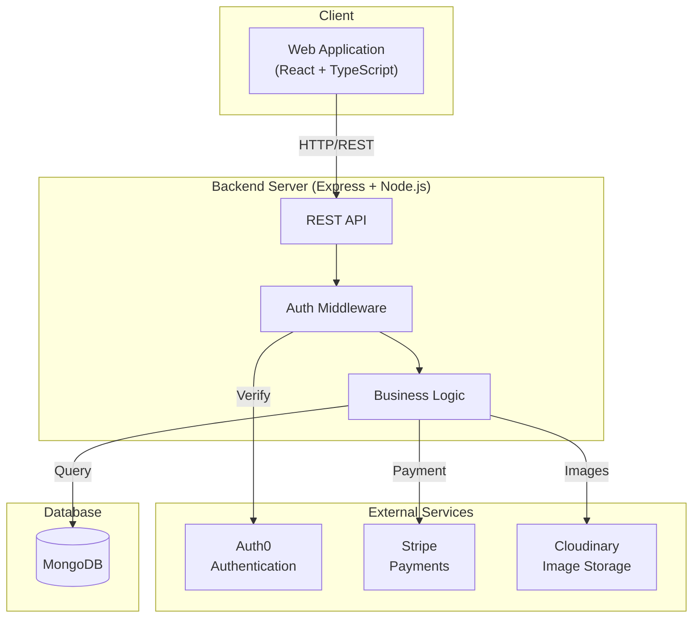

# System Architecture

## Overview
This document outlines the system architecture of the Food Ordering Application.

## System Components Diagram

## Component Description

### Frontend (React + TypeScript)
- User interface built with React and TypeScript
- State management using React Query
- UI components from Shadcn UI
- Authentication handled by Auth0

### Backend (Express + Node.js)
- RESTful API endpoints
- JWT-based authentication
- Business logic implementation
- External service integration

### External Services
- **Auth0**: User authentication and authorization
- **Stripe**: Payment processing
- **Cloudinary**: Image storage and management

### Database (MongoDB)
- Document-based data storage
- Mongoose ODM for data modeling
