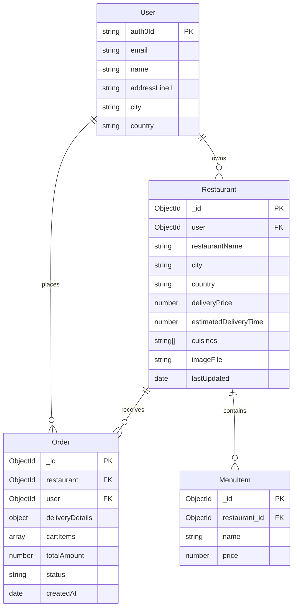

# Database Schema Documentation

## Entity Relationship Diagram

## Schema Details

### User Collection
- Primary identifier is `auth0Id` (string)
- Stores basic user information and delivery address
- Email must match valid email format
- All fields are optional except `auth0Id` and `email`

### Restaurant Collection
- Linked to User collection via `user` field (ObjectId)
- Contains restaurant details and menu items as a nested array
- Required fields include:
  - user (reference to owner)
  - restaurantName
  - city
  - country
  - deliveryPrice
  - estimatedDeliveryTime
  - cuisines (array of strings)
  - imageFile (for restaurant image)
- Automatically tracks `lastUpdated` timestamp

### Order Collection
- Links User and Restaurant collections
- Contains delivery details and cart items
- Status enum: ['placed', 'paid', 'inProgress', 'outForDelivery', 'delivered']
- Tracks creation timestamp automatically
- Cart items include:
  - menuItemId
  - quantity
  - name

## Relationships
1. User → Restaurant (1:N)
   - A user can own multiple restaurants
   - Each restaurant must have exactly one owner

2. User → Order (1:N)
   - A user can place multiple orders
   - Each order belongs to exactly one user

3. Restaurant → Order (1:N)
   - A restaurant can have multiple orders
   - Each order is associated with exactly one restaurant

4. Restaurant → MenuItem (1:N)
   - A restaurant can have multiple menu items
   - Menu items are embedded within the restaurant document

## Notes
- The schema uses MongoDB's flexible document model
- Timestamps are automatically managed for orders and restaurant updates
- Authentication is handled via Auth0 integration
- Menu items are embedded in the restaurant document for improved read performance