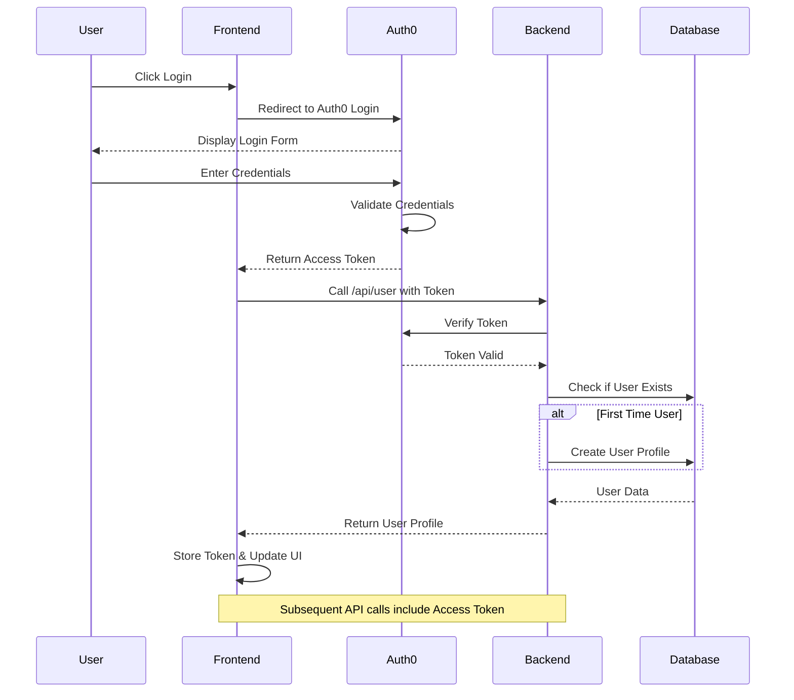

# Authentication Flow

## Process Description

1. **Initial Login**:
   - User initiates login through the frontend application
   - Frontend redirects to Auth0's login page
   - User provides credentials on Auth0's secure form

2. **Token Generation**:
   - Auth0 validates credentials and generates access token
   - Token is returned to frontend application
   - Frontend stores token for subsequent API calls

3. **User Profile Creation/Retrieval**:
   - Frontend makes API call to backend with token
   - Backend verifies token with Auth0
   - If new user, creates profile in database
   - Returns user profile data to frontend

4. **Session Management**:
   - Frontend maintains token in memory
   - All subsequent API calls include token
   - Token expiration handled automatically