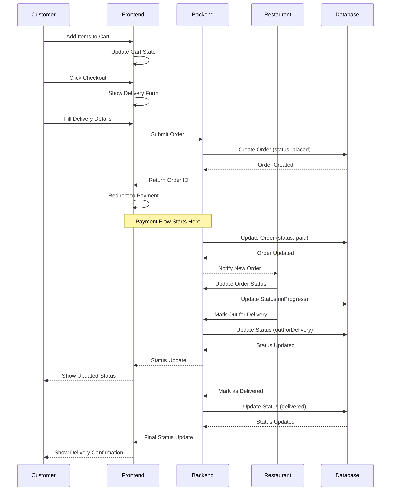

# Order Processing Flow

## Process Description

1. **Order Creation**:
   - Customer adds items to cart
   - Provides delivery details
   - System creates initial order

2. **Payment Processing**:
   - Order marked as placed
   - Payment flow initiated
   - Order updated when payment successful

3. **Restaurant Processing**:
   - Restaurant receives order notification
   - Updates order status as processed
   - Marks order for delivery

4. **Delivery Tracking**:
   - Status updates throughout delivery process
   - Customer notified of status changes
   - Final confirmation upon delivery