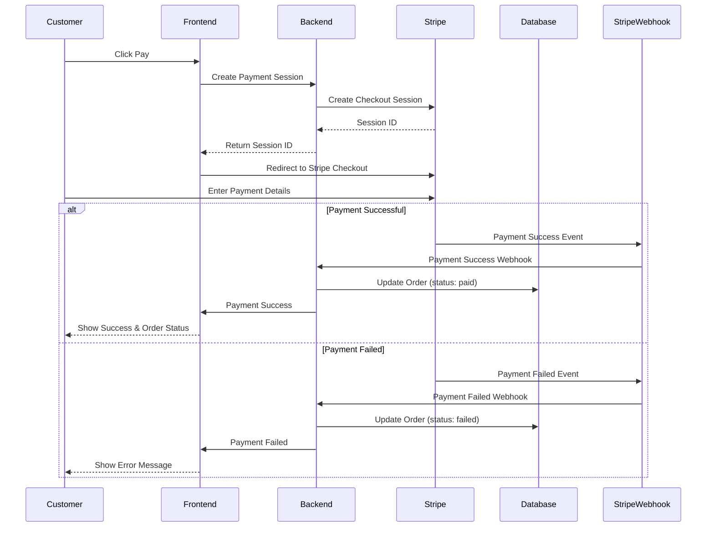

# Payment Processing Flow

## Process Description

1. **Payment Initiation**:

   - Customer confirms order and proceeds to payment
   - Backend creates Stripe checkout session
   - Frontend redirects to Stripe checkout page

2. **Payment Processing**:

   - Customer enters payment details on Stripe
   - Stripe processes payment securely
   - Webhook receives payment result

3. **Success Flow**:

   - Stripe confirms successful payment
   - Order status updated to paid
   - Customer redirected to success page

4. **Failure Flow**:
   - Payment failures handled gracefully
   - Order status updated
   - Customer notified of failure

## Technical Implementation Notes

1. **Stripe Integration Requirements**:
   - Stripe CLI for webhook testing
   - Webhook endpoint for payment events
   - Proper error handling
2. **Security Considerations**:

   - Webhook signatures verification
   - Secure handling of payment details
   - Payment idempotency

3. **Order Status Updates**:
   - Real-time status updates
   - Proper error handling
   - Transaction logging
